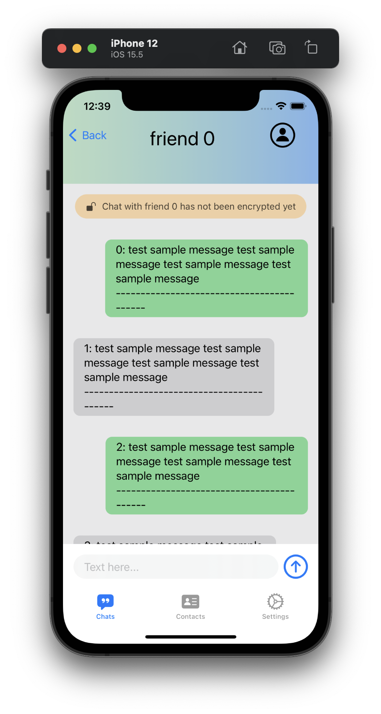
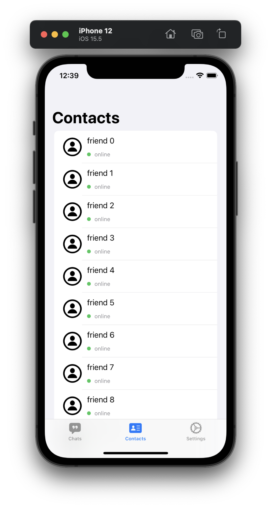
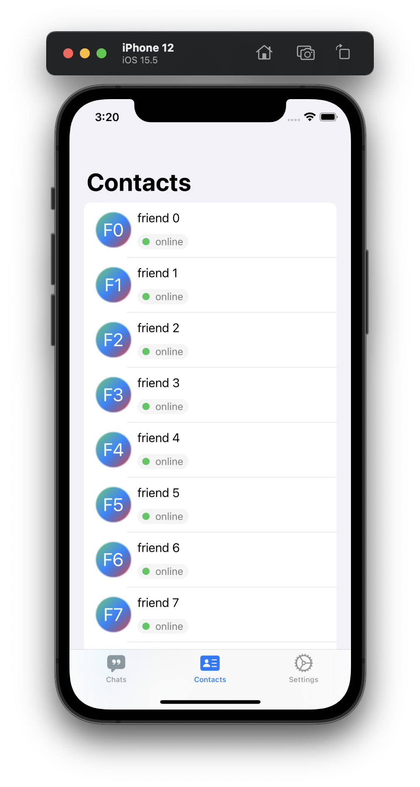
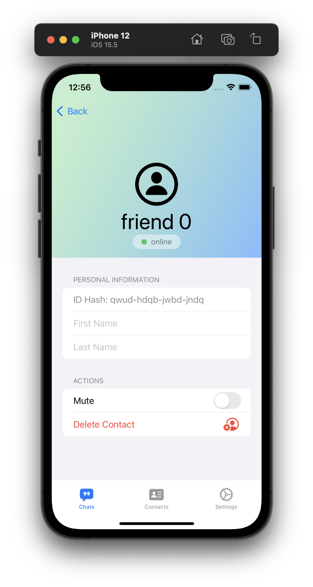

# client-iOS  
Anonymity Client side


## Files  
```  
.
├── README.md
├── imgs
│   ├── ver0.1-sketch/
│   └── ver0.2-sketch/
└── src
    └── Anonymity
        ├── Anonymity.xcodeproj/
        ├── Shared
        │   ├── AnonymityApp.swift
        │   ├── Assets.xcassets/
        │   ├── DataServices
        │   │   └── MessageDataService.swift
        │   ├── Models
        │   │   ├── Chat.swift
        │   │   ├── Message.swift
        │   │   └── User.swift
        │   ├── Persistence.swift
        │   ├── ViewModels
        │   └── Views
        │       ├── ChatView.swift
        │       ├── Components
        │       │   ├── AvatarView.swift
        │       │   └── OnlineStatusView.swift
        │       ├── ContactsView.swift
        │       ├── ContentView.swift
        │       ├── HomePageView.swift
        │       ├── MessageListView.swift
        │       ├── SettingsView.swift
        │       └── UserProfileView.swift
        ├── Tests iOS/
        ├── Tests macOS/
        └── macOS/

28 directories, 39 files
```  

## Environment
- `Swift 5.0`
- `macOS 12.4`
- `iOS 15.5`

## Usage  
- `To be finished.`  


## Download  
- `git clone --recurse-submodules https://github.com/Steve-Xyh/client-iOS.git`  


## Installation  
- `To be finished.`  

---

## TODO List
### UI
- [x] main page
- [x] chat page
- [x] user profile page
- [x] settings page
- [x] contacts page
- [x] sign in page

### Logic
- [x] sign in
- [x] add contacts
- [x] tmp VM Database
- [x] firebase
- [x] auth
- [x] communication
- [ ] encryption
    - [x] ECC key gen & publish
    - [ ] AES key distribution
    - [ ] AES symmetric encryption & decryption

---
## Screenshots
### Version 0.2-Sketch
#### 1. Home Page


#### 2. Chat Page


#### 3. User Profile Page


#### 4. Contacts Page


#### 5. Settings Page


---  
**Developed by [Steve X](https://github.com/Steve-Xyh/client-iOS) © 2017 - 2022**  
